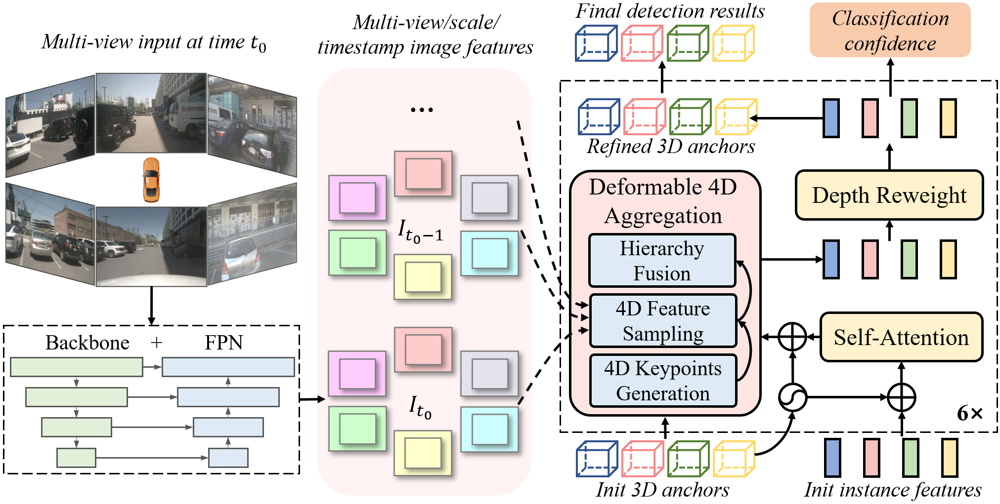

# Sparse4D

Sparse4D v2 will be released soon, which will have lower memory usage, as well as higher training and inference speed.

## Overall Architecture

[video demo](https://github.com/linxuewu/Sparse4D/releases/download/v0.0/video.avi)

## nuScenes Benchmark
|model|dataset| backbone | img size | mAP |mATE| mASE | mAOE |mAVE| mAAE | NDS | ckpt | log |
| :---: | :---: | :---: | :---: | :---:|:---:|:---: | :---: | :----: | :----: | :----: | :----: | :----: |
|Sparse4D|validation|Res101|640x1600|0.4409|0.6282|0.2721|0.3853|0.2922|0.1888|0.5438|[ckpt](https://github.com/linxuewu/Sparse4D/releases/download/v0.0/sparse4d_release.pth)|[log](https://github.com/linxuewu/Sparse4D/releases/download/v0.0/sparse4d.log)|


## Quick Start
 Install requirements.
```shell
pip install -r requirements.txt
```

Download nuScenes dataset, pretrain checkpoint([fcos3d.pth ResNet101](https://github.com/linxuewu/Sparse4D/releases/download/v0.0/fcos3d.pth)), pkl files([nuscenes_infos_trainval_with_inds.pkl](https://github.com/linxuewu/Sparse4D/releases/download/v0.0/nuscenes_infos_trainval_with_inds.pkl)) and init anchor centers([nuscenes_kmeans900.npy](https://github.com/linxuewu/Sparse4D/releases/download/v0.0/nuscenes_kmeans900.npy)). Adjust the directory structure as follows:
```shell
Sparse4D
├── data
│   ├── nuscenes
│   │   ├── maps
│   │   ├── lidarseg
│   │   ├── samples
│   │   ├── sweeps
│   │   ├── v1.0-mini
│   │   ├── v1.0-test
|   |   └── v1.0-trainval
│   ├── nuscenes_cam
│   │   ├── nuscenes_infos_test.pkl
│   │   ├── nuscenes_infos_train.pkl
│   │   ├── nuscenes_infos_val.pkl
│   │   └── nuscenes_infos_trainval_with_inds.pkl
├── projects
│   ├── configs
│   │   ├── default_runtime.py
│   │   ├── sparse4d_r101_H1.py
│   │   ├── sparse4d_r101_H4.py
│   │   └── ...
│   └── mmdet3d_plugin
│       ├── apis
│       ├── core
│       ├── datasets
│       └── models
├── tools
│   ├── dist_test.sh
│   ├── dist_train.sh
│   ├── test.py
│   └── train.py
├── local_test.sh
├── local_train.sh
├── fcos3d.pth
└── nuscenes_kmeans900.npy
```

Train with config_name.py.
```shell
bash local_train.sh config_name
```

Test checkpoint_file with config_name.py.
```shell
bash local_test.sh config_name checkpoint_file 
```

## Citation
```
@misc{2211.10581,
  Author = {Xuewu Lin and Tianwei Lin and Zixiang Pei and Lichao Huang and Zhizhong Su},
  Title = {Sparse4D: Multi-view 3D Object Detection with Sparse Spatial-Temporal Fusion},
  Year = {2022},
  Eprint = {arXiv:2211.10581},
}
```

## Acknowledgement

- [BEVFormer](https://github.com/fundamentalvision/BEVFormer)
- [detr3d](https://github.com/WangYueFt/detr3d) 
- [mmdet3d](https://github.com/open-mmlab/mmdetection3d)
