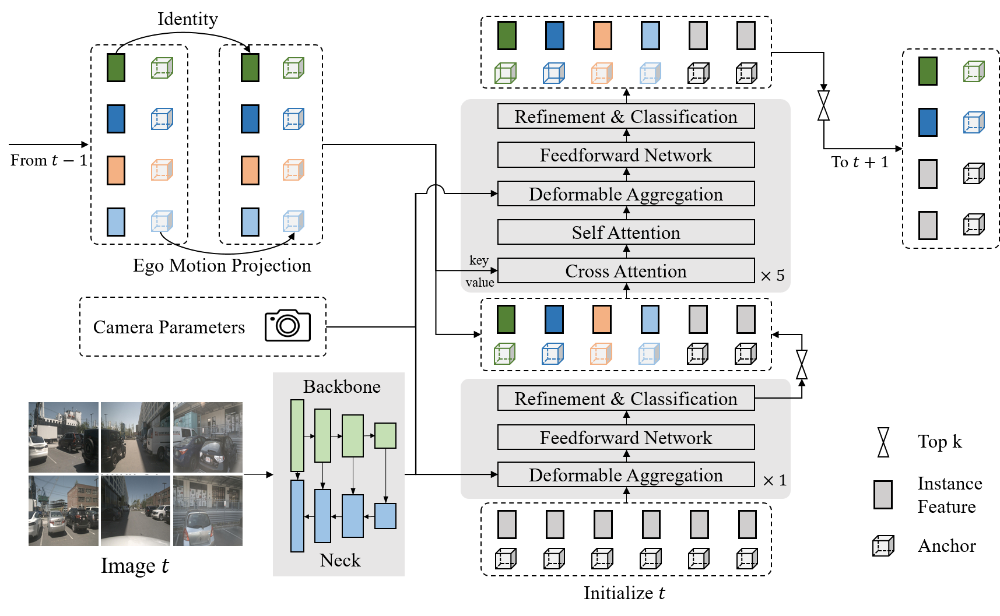

# Sparse4D

**【2024/01/22】The code repository for Sparse4D has been migrated to [HorizonRobotics/Sparse4D](https://github.com/HorizonRobotics/Sparse4D/tree/main), and the code for Sparse4Dv3 has also been open-sourced in the new code repository!!! Everyone is welcome to use it.**

**【2023/11/21】 The paper of [Sparse4Dv3](https://arxiv.org/abs/2311.11722) has been published.**

**Sparse4Dv3 is about to be released, featuring stronger detection performance and end-to-end tracking capabilities.**

**State-of-the-Art Performance of Sparse4Dv2 in the [nuScenes Benchmark](https://www.nuscenes.org/object-detection?externalData=all&mapData=all&modalities=Camera) for Online Models.**

## Overall Architecture
### Sparse4D v2


### Sparse4D v1

<!-- [video demo](https://github.com/linxuewu/Sparse4D/releases/download/v0.0/video.avi) -->

## nuScenes Benchmark
### Validation
These experiments were conducted using 8 RTX 3090 GPUs with 24 GB memory.
|model | backbone |pretrain| img size | Epoch | Traning | FPS | NDS | mAP | config | ckpt | log |
|  :----:  | :---: | :---: | :---: | :---: | :---:| :---:|:---:|:---: | :---: | :----: | :----: |
|Sparse4D-T4 |Res101|[FCOS3D](https://github.com/linxuewu/Sparse4D/releases/download/v0.0/fcos3d.pth)|640x1600|24|2Day5H|2.9|0.5438|0.4409|[cfg](https://github.com/linxuewu/Sparse4D/blob/main/projects/configs/sparse4d_r101_H4.py)|[ckpt](https://github.com/linxuewu/Sparse4D/releases/download/v0.0/sparse4dv1_r101_H4_release.pth)|[log](https://github.com/linxuewu/Sparse4D/releases/download/v0.0/sparse4d.log)|
|Sparse4Dv2|Res50|[ImageNet](https://download.pytorch.org/models/resnet50-19c8e357.pth)|256x704| 100 |15H | 20.3 |0.5384|0.4392|[cfg](https://github.com/linxuewu/Sparse4D/blob/main/projects/configs/sparse4dv2_r50_HInf_256x704.py)|[ckpt](https://github.com/linxuewu/Sparse4D/releases/download/v0.0/sparse4dv2_r50_HInf_256x704.pth)|[log](https://github.com/linxuewu/Sparse4D/releases/download/v0.0/sparse4dv2_r50_HInf_256x704.log.json)|
|Sparse4Dv2|Res101|[nuImage](https://download.openmmlab.com/mmdetection3d/v0.1.0_models/nuimages_semseg/cascade_mask_rcnn_r50_fpn_coco-20e_20e_nuim/cascade_mask_rcnn_r50_fpn_coco-20e_20e_nuim_20201009_124951-40963960.pth)|512x1408| 100 |2Day | 8.4 |0.5939|0.5051|-|-|-|

### Test
|model| backbone | img size | NDS | mAP |mATE| mASE | mAOE |mAVE| mAAE |
| :---: | :---: | :---: | :---: | :---:|:---:|:---: | :---: | :----: | :----: |
|Sparse4D-T4|Vov-99|640x1600|0.595|0.511|0.533|0.263|0.369|0.317|0.124|
|Sparse4Dv2|Vov-99|640x1600|0.638|0.556|0.462|0.238|0.328|0.264|0.115|

## Quick Start
 Install requirements.
```shell
pip install -r requirements.txt
cd projects/mmdet3d_plugin/ops
python setup.py develop
```

Download nuScenes dataset, pretrain checkpoint([fcos3d.pth ResNet101](https://github.com/linxuewu/Sparse4D/releases/download/v0.0/fcos3d.pth)), pkl files([nuscenes_infos_trainval_with_inds.pkl](https://github.com/linxuewu/Sparse4D/releases/download/v0.0/nuscenes_infos_trainval_with_inds.pkl)) and init anchor centers([nuscenes_kmeans900.npy](https://github.com/linxuewu/Sparse4D/releases/download/v0.0/nuscenes_kmeans900.npy)). Adjust the directory structure as follows:
```shell
Sparse4D
├── data
│   ├── nuscenes
│   │   ├── maps
│   │   ├── lidarseg
│   │   ├── samples
│   │   ├── sweeps
│   │   ├── v1.0-mini
│   │   ├── v1.0-test
|   |   └── v1.0-trainval
│   ├── nuscenes_cam
│   │   ├── nuscenes_infos_test.pkl
│   │   ├── nuscenes_infos_train.pkl
│   │   ├── nuscenes_infos_val.pkl
│   │   └── nuscenes_infos_trainval_with_inds.pkl
├── projects
│   ├── configs
│   │   ├── default_runtime.py
│   │   ├── sparse4d_r101_H1.py
│   │   ├── sparse4d_r101_H4.py
│   │   └── ...
│   └── mmdet3d_plugin
│       ├── apis
│       ├── core
│       ├── datasets
│       └── models
├── tools
│   ├── dist_test.sh
│   ├── dist_train.sh
│   ├── test.py
│   └── train.py
├── local_test.sh
├── local_train.sh
├── fcos3d.pth
└── nuscenes_kmeans900.npy
```

Train with config_name.py.
```shell
bash local_train.sh config_name
```

Test checkpoint_file with config_name.py.
```shell
bash local_test.sh config_name checkpoint_file 
```

## Citation
```
@misc{2305.14018,
Author = {Xuewu Lin and Tianwei Lin and Zixiang Pei and Lichao Huang and Zhizhong Su},
Title = {Sparse4D v2: Recurrent Temporal Fusion with Sparse Model},
Year = {2023},
Eprint = {arXiv:2305.14018},
}

@misc{2211.10581,
  Author = {Xuewu Lin and Tianwei Lin and Zixiang Pei and Lichao Huang and Zhizhong Su},
  Title = {Sparse4D: Multi-view 3D Object Detection with Sparse Spatial-Temporal Fusion},
  Year = {2022},
  Eprint = {arXiv:2211.10581},
}
```

## Acknowledgement
- [BEVFormer](https://github.com/fundamentalvision/BEVFormer)
- [detr3d](https://github.com/WangYueFt/detr3d) 
- [mmdet3d](https://github.com/open-mmlab/mmdetection3d)
- [SOLOFusion](https://github.com/Divadi/SOLOFusion/tree/main/configs/solofusion)
